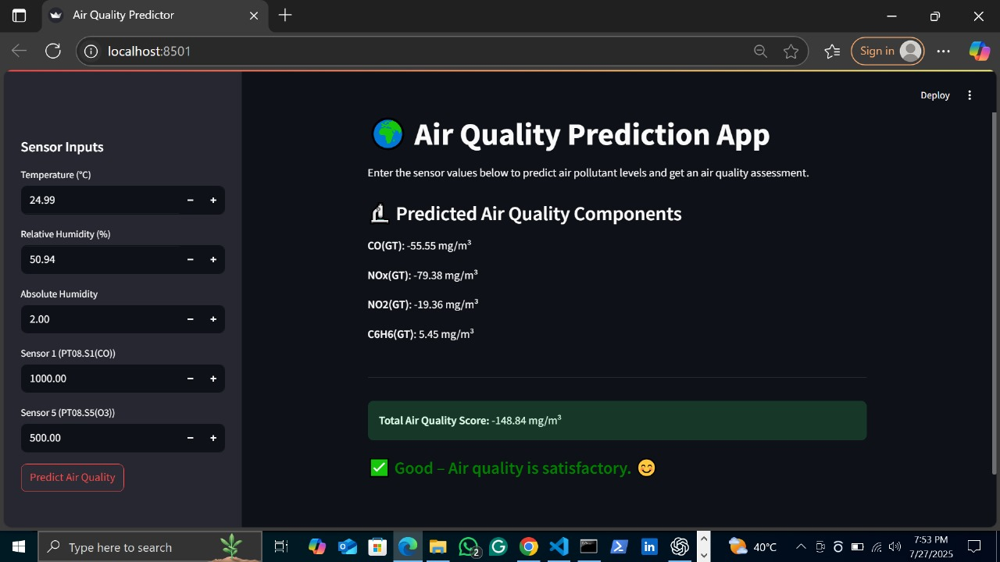

#  Air Quality Prediction App

This project is a Streamlit-based web application that predicts multiple air pollutants using sensor input data. It utilizes a **Multi-Output Linear Regression model** trained on real-world air quality sensor readings.


##  Project Overview

- **Goal:** Predict the concentration of air pollutants such as `CO(GT)`, `NOx(GT)`, `NO2(GT)`, and `C6H6(GT)` using environmental and sensor inputs.
- **Technique:** Multi-output regression with `LinearRegression` from scikit-learn.
- **Interface:** Built using Streamlit to allow interactive predictions.


## How to Run Locally

1. Clone the repository  
   ```bash
   git clone https://github.com/your-username/air-quality-app.git
   cd air-quality-app
   ```

2. Install dependencies 
   ```bash
   pip install pandas scikit-learn streamlit joblib
   ```

3. Run the app  
   ```bash
   streamlit run predict.py
   ```


## UI Preview



---

## Future Improvements
- Add visualizations (e.g., pollutant trends)

- Use a more advanced model (e.g., Random Forest or XGBoost)

- Add file upload option for batch predictions


## Author

**Bushra Aqib**  
BSc Artificial Intelligence  

 [LinkedIn](https://www.linkedin.com/in/bushra-aqib)

---


 
